# ComfyUI CineStyle

ComfyUI_CineStyle 是一组为ComfyUI 视频工作流开发的，更易于使用的自定义节点。
本项目是为轻量级视频处理而设定，不能替代专业视频编辑软件。


### 安装插件
* 使用ComfyUI Manager，搜索"ComfyUI_CineStyle"，安装插件。
* 或者在CompyUI插件目录(例如“CompyUI\custom_nodes\”)中打开cmd窗口，键入
```
git clone https://github.com/chflame163/ComfyUI_CineStyle.git
```


### 如何找到本节点组
* 在ComfyUI画布点击右键 - Add Node, 找到 "😺dzNodes/CineStyle"。
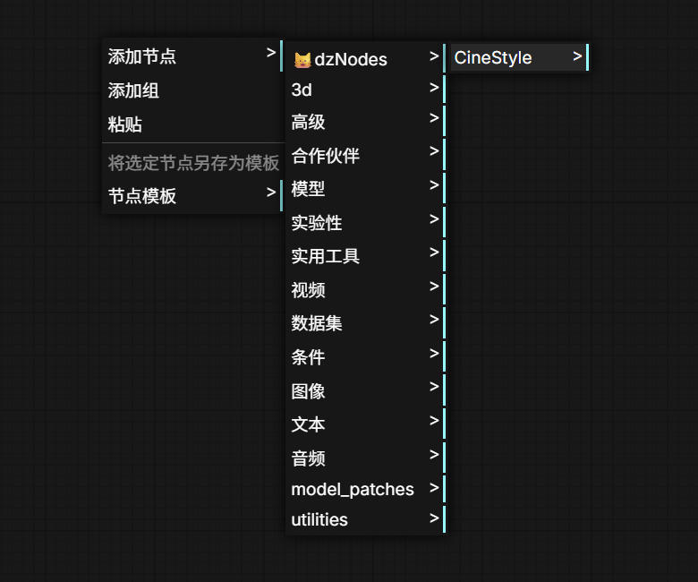

* 或者在ComfyUI画布双击, 在搜索框输入"cinestyle"。
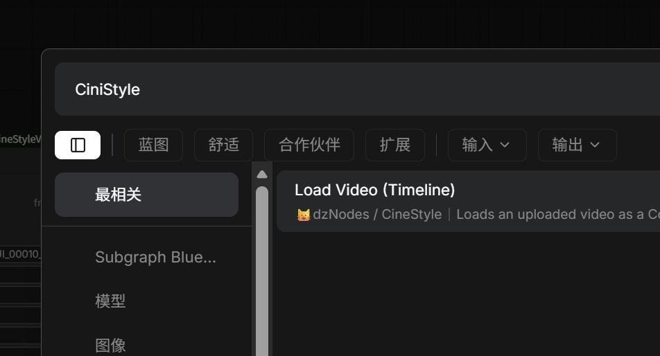

#### 示例工作流

workflow JSON 和示例素材位于插件的 `workflows` 子目录。本文档图片仅为示意。


## 更新说明

* 添加 [CS Preview Any](#cs-preview-any) 节点，自动识别并预览 ComfyUI 的常见图像、视频、音频和数据类型。
* 添加 [CS Mask Grow](#cs-mask-grow) 节点，较官方Grow Mask节点运算速度大幅提升，并能更好的保持轮廓特征。
* 添加 [CS Color Grade](#cs-color-grade) 节点，提供 HEX 白点、色温/色调、基础调色、RGB 通道控制、RGB多通道曲线和LUT加载，对视频进行专业级调色。
* 添加 [CS Video Subtitle](#cs-video-subtitle) 节点，将 SRT 字幕渲染到标准 ComfyUI VIDEO，并提供字幕时间线编辑器。
* 添加 [CS MOSS Audio Transcribe](#cs-moss-audio-transcribe) 节点，将标准 ComfyUI AUDIO 转写为带时间戳的 SRT。
* 添加 [CS VFX Beauty](#cs-vfx-beauty) 节点，自动估算视频片段肤色并执行皮肤磨皮美化处理。
* 添加 [CS Video Segment (SAM3.1)](#cs-video-segment-sam31) 节点，在锚点帧用 Semantic、粗略 Mask、Point 或 BBox 定义对象，并自动传播 mask。
* 添加 [CS Video Segment (SeC-4B)](#cs-video-segment-sec-4b) 节点，使用 SeC-4B 的概念理解和 LongSAM2.1 记忆传播 mask。
* 添加 [CS SeC-4B Model Loader](#cs-sec-4b-model-loader) 节点，用于加载和复用 SeC-4B 推理模型。
* 添加 [CS Load Video](#cs-load-video) 节点，用于加载视频，支持出入点设置、更改画面尺寸和帧率。
* 添加 [CS Save Video](#cs-save-video) 节点，支持可选 metadata 写入、符合行业惯例的 H.264 目标码率控制。


## 节点说明

### CS Preview Any

自动识别输入数据类型并提供统一的多视口预览节点。节点包含画面视口和文本视口：画面视口用于显示图片、Mask、视频或音频波形，文本视口用于显示类型、尺寸、批次和调试信息。

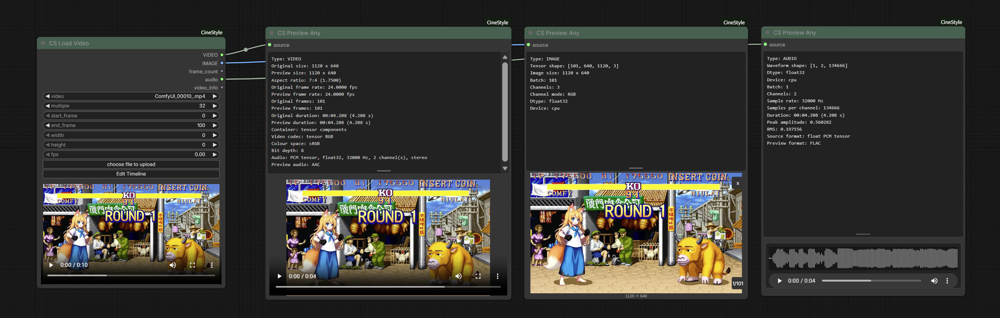

#### 使用流程

1. 将任意 ComfyUI 节点的输出连接到 `source`。`source` 接受任意类型，不需要预先指定输入类型。
2. 执行工作流，节点会根据实际输入自动选择预览方式。


#### 支持的类型

- `VIDEO`：使用临时 Preview Cache 生成保持宽高比的预览视频，预览像素数上限为 1 Mpixels，预览帧率上限为 25 fps，并保留完整输入时长。注意预览视频的画面大小和质量经过处理，并非原始精度。保存原始精度的视频文件请使用 `CS Save Video` 节点。
- `IMAGE`：按 ComfyUI 原生图片预览方式显示图片，可以在列表和单张显示之间切换。文本视口显示 Tensor 形状、图片尺寸、批次和通道模式。
- `MASK`：按 ComfyUI 原生 mask 预览显示 Mask，并显示对应的形状、尺寸和批次信息。
- `AUDIO`：画面视口显示音频波形；文本视口显示波形形状、采样率、声道、时长、峰值和 RMS 等信息。
- `STRING`、`BOOL`、`INT`、`FLOAT`：在文本视口显示类型和值。
- `LATENT`：在文本视口显示 latent 的形状、dtype、device、批次、通道、维度、统计值、keys、noise mask 和 batch index 等元数据。
- `LIST`、`DICT`：在文本视口显示长度以及调试信息。数值 item 显示值，非数值对象只显示类型。

其他无法预览的对象只显示数据类型；无法识别的数据会显示 `Unable to parse data type`。


### CS Mask Grow

使用精确离散欧氏圆盘算法， 对`MASK` 进行精确欧氏距离的膨胀或收缩。较官方Grow Mask节点运算速度大幅提升，并避免了大 grow 值下产生菱形轮廓的曼哈顿距离问题，能更好的保持轮廓特征。

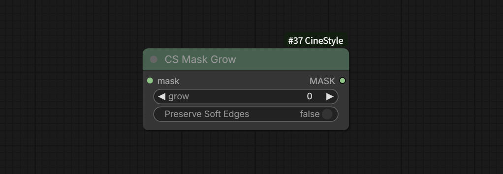

#### 节点输入

- `mask`：标准 ComfyUI `MASK`。
- `grow`：以像素为单位；正值向外膨胀，负值向内收缩，`0` 不改变尺寸。
- `Preserve Soft Edges`：默认关闭。关闭时先以灰度值 `128` 为阈值将输入二值化，输出仅包含 `0/1`；开启时保留输入 Mask 的灰度 alpha 过渡。

#### 输出

- `MASK`：与输入帧数和画面尺寸相同的标准 ComfyUI `MASK`。


### CS Color Grade

提供 HEX 白点、色温/色调、基础调色、RGB 通道控制、RGB多通道曲线和LUT加载，对视频进行专业级调色。

#### 使用流程

1. 将图片节点或 `CS Load Video` 的 `IMAGE` 输出连接到 `image`。`CS Load Video` 输入可以为视频帧批次，节点会按帧批次逐块处理。
2. 将可选的 `MASK` 连接到 `mask`。黑色区域保持原图，白色区域应用完整调色，灰度区域按遮罩值线性混合。
3. 将 `.cube` 文件放入 `ComfyUI/models/luts/`，在 `Load LUT` 中选择文件；不需要外部 LUT 时选择 `None`。使用 `LUT Strength` 控制外部 LUT 的混合强度，`0` 为不应用 LUT，`1` 为完整应用。
4. 直接执行节点得到 RGB `IMAGE`，或先点击 `Grade Preview` 调整当前帧，再点击 `Apply to Node` 将预览参数写回节点。
5. 如果输入来自上游运行后才生成的图像或视频，首次打开 `Grade Preview` 前先运行一次工作流建立 Preview cache。

#### 节点输入

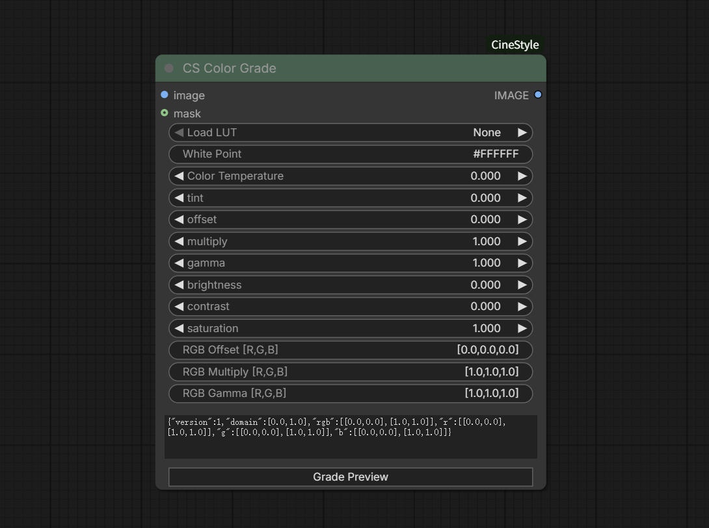

- image：标准 ComfyUI `IMAGE`，自动预览功能仅在接入CS Load Video节点时支持。
- mask：可选标准 ComfyUI `MASK`。
- Load LUT：加载外部LUT文件，默认 `None`。支持 1D LUT、3D LUT，以及带 1D Shaper 的 1D+3D LUT。新增文件后需要刷新节点列表或重启 ComfyUI 才会出现在选项中。
- LUT Strength：外部 LUT 的混合强度，范围 `0–1`，默认 `1`。`0` 保持应用其它调色参数后的结果，`0.5` 为一半 LUT 效果，`1` 为完整 LUT 效果。
- White Point：`#RRGGBB` 格式的颜色字符串，默认 `#FFFFFF`对应中性白点。
- Color Temperature：范围 `-1–1`，默认 `0`。与 `Tint` 一起参与白平衡计算。
- Tint：白平衡中的绿色/洋红偏移，范围 `-1–1`，默认 `0`。
- Offset：三个通道同时增加的整体偏移，范围 `-1–1`，默认 `0`。
- Multiply：三个通道同时使用的整体增益，范围 `0–2`，默认 `1`。
- Gamma：三个通道同时使用的 Gamma，范围 `0–10`，默认 `1`；实际计算使用 `1 / Gamma` 指数，并保留负值的符号。Gamma 必须大于 epsilon。
- Brightness：Gamma 后的整体加法偏移，范围 `-1–1`，默认 `0`。
- Contrast：以 `0.5` 为中心的线性对比度，范围 `-1–1`，默认 `0`。`0` 不改变对比度，`-1` 将所有值压到 `0.5`，正值提高对比度。
- Saturation：基于 Rec.709 亮度权重的饱和度，范围 `0–10`，默认 `1`。`0` 为灰度，`1` 保持原饱和度，大于 `1` 会增强色彩。
- RGB Offset：分别作用于 R、G、B 的偏移数组，默认 `[0.0,0.0,0.0]`。
- RGB Multiply：分别作用于 R、G、B 的增益数组，默认 `[1.0,1.0,1.0]`。
- RGB Gamma：分别作用于 R、G、B 的 Gamma 数组，默认 `[1.0,1.0,1.0]`；每个通道必须大于 epsilon。
- curves：RGB 主曲线和 R/G/B 独立曲线的 JSON 字符串。该输入属于高级参数，通常通过 `Grade Preview` 编辑，不建议手动修改。


#### 输出

- `IMAGE`：调色后的 RGB 图像。

#### 外部 LUT
LUT 文件必须放在 `ComfyUI/models/luts`

#### Grade Preview

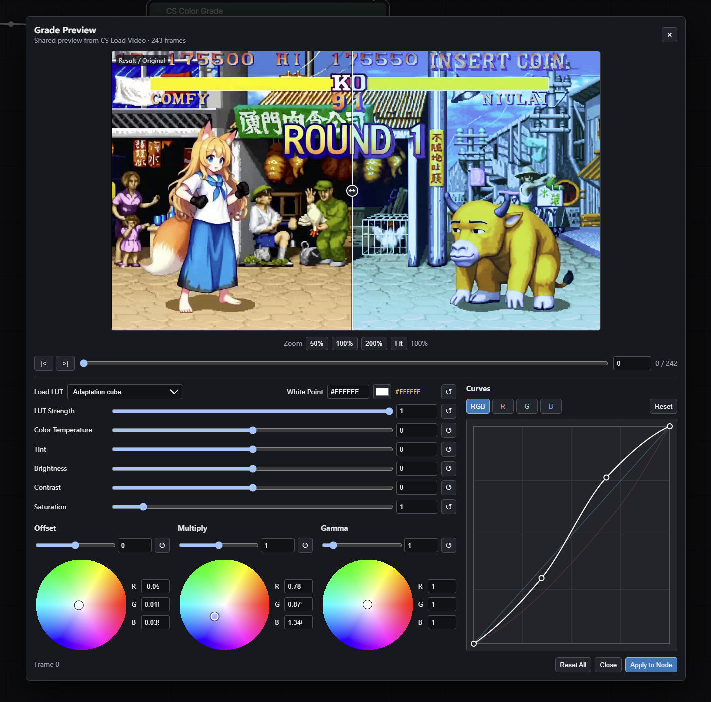

Preview 窗口包含当前帧预览、对比层、缩放、时间线和调色参数区：

- 预览视口显示 `Result / Original`。拖动中间的对比条可以在原图和结果之间进行左右比较。
- `50%`、`100%`、`200%` 和 `Fit` 用于设置缩放；放大后按住鼠标左键拖动可以平移画面，鼠标滚轮也可以调整缩放比例。
- 时间线支持拖动定位、帧号输入，以及 `|<` / `>|` 单帧前进和后退。视频帧批次会显示总帧数。
- 点击 White Point 的色块打开取色器，旁边的文本框接受严格的 `#RRGGBB` 格式。
- `LUT Strength`、`Color Temperature`、`Tint`、`Brightness`、`Contrast` 和 `Saturation` 使用滑块，并保留数值输入框和单项重置按钮；拖动 LUT 强度会实时更新当前帧预览。
- `Offset`、`Multiply` 和 `Gamma` 包含整体滑块、RGB 色轮以及 R/G/B 数值。在色轮上拖动鼠标改变对应的 RGB 通道参数，数值框可进行精确调整。
- 曲线可分别调整 `RGB`、`R`、`G`、`B` 四个通道；`Reset` 重置当前曲线。在曲线编辑器单击空白处添加点，按住拖动控制点，右键删除点；端点不可删除。
- `Reset All` 重置所有参数、RGB 数组、LUT 选择和曲线。
- 点击 `Apply to Node` 把当前参数写回节点；点击 `Close` 关闭窗口并放弃未应用的修改。


### CS MOSS Audio Transcribe

使用 [MOSS-Transcribe-Diarize](https://huggingface.co/OpenMOSS-Team/MOSS-Transcribe-Diarize) 模型，将 `AUDIO` 转写为带时间戳的 SRT 文本。
首次运行会自动下载模型。或者从[OpenMOSS-Team/MOSS-Transcribe-Diarize/](https://huggingface.co/OpenMOSS-Team/MOSS-Transcribe-Diarize/tree/main) 手动下载模型，然后放到`ComfyUI/models/moss`目录。

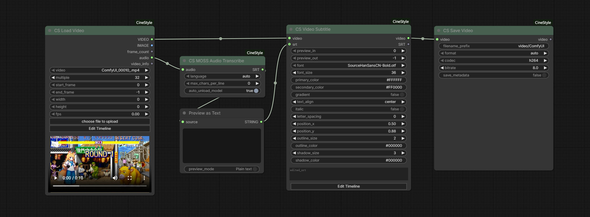

#### 使用流程

1. 将标准 ComfyUI `AUDIO` 输出连接到 `audio`。
2. 选择语言模式和字幕分行长度。
3. 执行节点，获得 SRT 文本，可直接连接到 `CS Video Subtitle` 的 `srt` 输入。


#### 节点选项说明
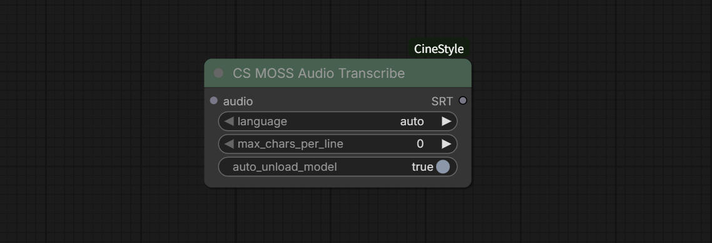
- `audio`：标准 ComfyUI `AUDIO` 输入，支持单声道或多声道音频。
- `language`：语言模式，可选 `auto`、`中文` 或 `English`。
- `max_chars_per_line`：每行最大字符数，`0` 表示不主动分行。
- `auto_unload_model`：默认开启。执行完成后释放 MOSS 推理运行时和 CUDA 显存。

#### 输出说明

- `srt`：标准 SRT 格式的 `STRING` 文本，包含序号、起止时间和字幕正文。


### CS Video Subtitle

将 SRT 字幕渲染到标准 ComfyUI `VIDEO`，并提供可交互的 Subtitle Timeline。字幕样式包括字体、字号、颜色、渐变、对齐、斜体、字距、位置、描边和阴影。
节点从ComfyUI/models/fonts 目录扫描并加载字体。请提前将字体放置到此目录。

#### 使用流程

1. 将 CS Load Video 或其他兼容节点的 `VIDEO` 输出连接到 `video`。自动预览功能仅在接入CS Load Video节点时支持。
2. 将 SRT 文本连接到 `srt`；如果不连接 `srt`，节点会自动使用 `edited_srt` 中保存的字幕。
3. 点击 `Edit Timeline` 编辑字幕时间、样式和位置。
4. 点击 `Apply` 保存字幕设置，再执行节点得到最终视频。

#### 节点选项说明
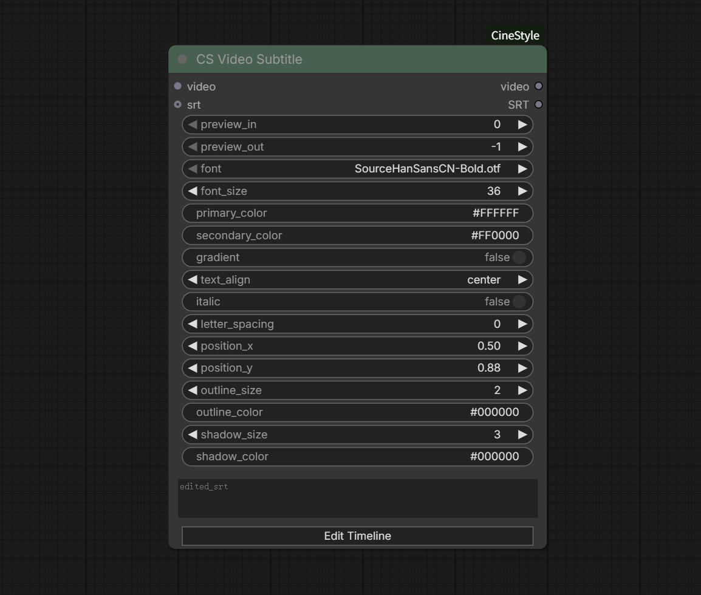
- `video`：兼容 ComfyUI `VIDEO` 类型的输入，自动预览功能仅在接入CS Load Video节点时支持。
- `srt`：可选 `STRING`。只要该输入已连接，节点始终以 `srt` 为准。如果无法从上游节点回溯srt，则时间线为空。
- `edited_srt`：经Timeline 编辑保存的 SRT 文本；可在 Timeline 中通过`Load Edited SRT`按钮加载到时间线，或在 `srt` 输入未连接时自动使用。
- `preview_in` / `preview_out`：字幕 Timeline 的预览范围，分别表示起始帧和结束帧。
- `font`：字幕字体。
- `font_size`：字体大小，范围 `8–200`。
- `primary_color` / `secondary_color`：字幕主色和渐变辅助色。
- `gradient`：是否启用垂直渐变填充。
- `text_align`：文本对齐方式，可选 `left`、`center`、`right`。
- `italic`：是否使用斜体。
- `letter_spacing`：字距，范围 `-10–50`。
- `position_x` / `position_y`：字幕位置的规范化坐标，范围 `0–1`。
- `outline_size` / `outline_color`：描边大小和颜色。
- `shadow_size` / `shadow_color`：阴影大小和颜色。

#### 输出说明

- `video`：渲染字幕后的标准 ComfyUI `VIDEO`，保留输入视频帧率、音频和时间范围。
- `srt`：当前节点最终采用的 SRT 文本，可连接到其他字幕或文本节点。

#### Edit Timeline 界面

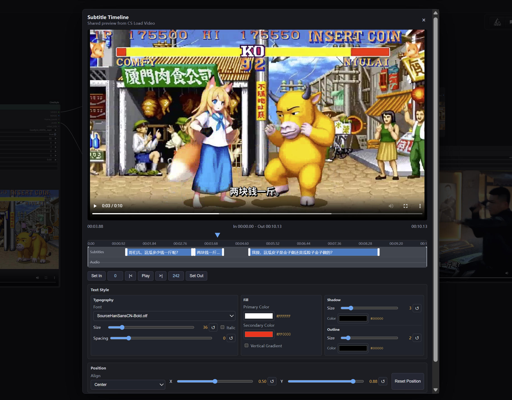

Subtitle Timeline 前端界面由视频预览、时间线、字幕样式编辑和位置调整区域组成。

- 预览区域显示当前视频帧和字幕效果。可播放、暂停和拖动查看画面，预览中的字幕会随当前帧更新。
- 时间线包含 `Subtitles` 和 `Audio` 两条轨道。字幕轨道显示每条字幕的时间范围，音频轨道显示声音波形；拖动当前帧指针或使用播放、前进、后退按钮可以定位画面。
- `Load Edited SRT`：手动加载节点中保存的 `edited_srt`，用于在获得新的上游 SRT 后恢复之前的编辑结果；不会改变节点的 `srt` 输入优先级。
- 使用 `Set In` 和 `Set Out` 设置字幕 Timeline 的预览起止帧。
- 在字幕轨道中双击字幕片段，或使用右键菜单，可以编辑、复制、粘贴或删除字幕内容；字幕片段可在时间线上拖动调整时间范围。
- `Text Style` 区域用于设置字体、字号、斜体、字距、主色、渐变色、描边和阴影。
- `Position` 区域用于设置文字对齐方式以及规范化的 X/Y 位置。也可以直接在预览画面中拖动字幕，使用边角控制点调整文字区域大小。
- 点击 `Apply` 将当前时间范围、字幕文本、样式和位置写回节点；点击 `Cancel` 放弃本次编辑。


注意：如果想强制使用节点内已编辑的字幕时间线`edited_srt`，请断开`str`的输入，否则渲染时`edited_srt`不会生效，仍然使用`srt`输入的内容。
对于运行后才生成的视频输入，先运行一次工作流建立缓存，再打开节点前端窗口。


### CS VFX Beauty
为视频优化的皮肤磨皮美化处理节点。节点优先使用输入的 `MASK`；没有连接 `MASK` 时，自动使用 BiSeNet 估算目标肤色。

#### 部署 BiSeNet 权重

权重文件 `parsing_bisenet.pth`放置于：

```text
ComfyUI/models/facexlib/parsing_bisenet.pth
```

首次运行且本地不存在权重时，节点会自动从 FaceXLib 上游官方的 [GitHub Release 下载地址](https://github.com/xinntao/facexlib/releases/download/v0.2.0/parsing_bisenet.pth) 或者 Hugging Face 上的 [parsing_bisenet.pth 镜像](https://huggingface.co/jellyhe/parsing_bisenet.pth/resolve/main/parsing_bisenet.pth) 下载权重。
也可以手动下载后放置到 `ComfyUI/models/facexlib/parsing_bisenet.pth`。


#### 使用流程

- 将视频帧批次连接到 `image`。节点也支持接入官方或第三方 `Load Image`节点，自动预览功能仅在接入CS Load Video节点时支持。
- 如果有现成的皮肤区域，将标准 ComfyUI `MASK` 连接到 `mask`；没有 `mask` 时，首次自动估色会使用 BiSeNet 临时生成皮肤区域。
- 保持 `colour=auto` 使用整段输入的自动肤色估计，或输入合法的 `#RRGGBB` 颜色跳过自动估色。
- 点击节点底部的 `VFX Preview`，在当前帧调整参数并实时预览；确认后点击 `Apply to Node` 保存预览参数。

#### 节点选项说明
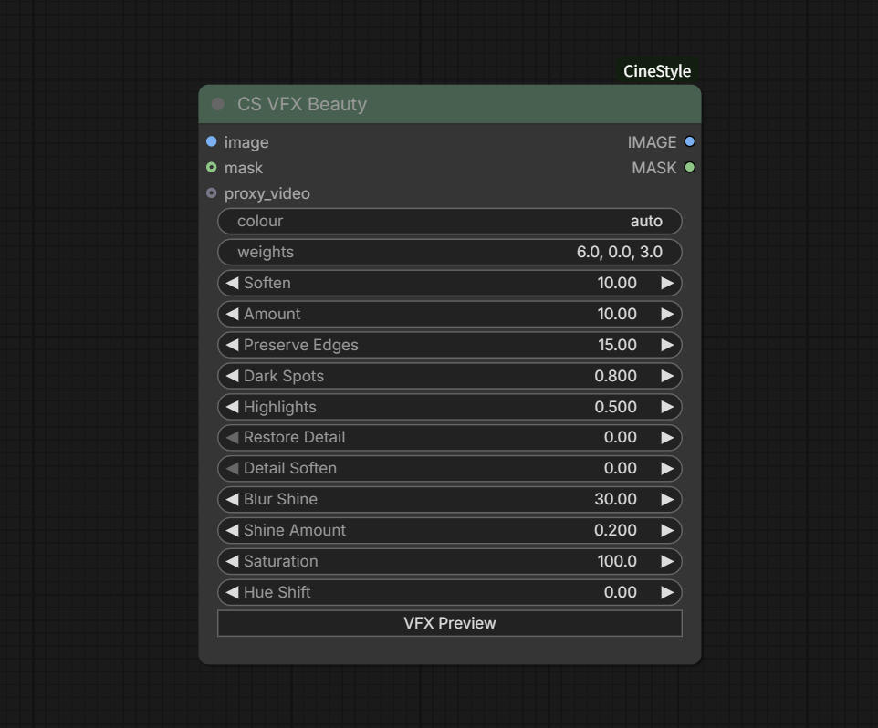
- image：标准 ComfyUI `IMAGE`，支持 `[batch, height, width, channels]` 的单张图片或视频帧批次。自动预览功能仅在接入CS Load Video节点时支持。
- mask：可选标准 ComfyUI `MASK`。连接后自动作为皮肤处理区域，也作为自动肤色估计区域。
- colour：字符串，默认 `auto`。`auto` 使用自动估色；输入 `#RRGGBB` 时直接使用指定 RGB 颜色。
- weights：HSV Key 权重字符串，默认 `6.0, 0.0, 3.0`。在 VFX Preview 中会拆分为 Hue、Saturation、Value 三个独立输入，Apply 时保存参数。
- blur_m / Soften：皮肤 Matte 的柔化半径，默认 `10.0`。
- sigma / Amount：边缘保持模糊强度，默认 `10.0`。
- threshold / Preserve Edges：边缘保护阈值，默认 `15.0`。
- r_spots_blend / Dark Spots：暗斑修复混合比例，默认 `0.8`。
- r_h_blend / Highlights：高光修复混合比例，默认 `0.5`。
- strength / Restore Detail：高频细节恢复强度，默认 `0.0`。
- blur_h / Detail Soften：恢复细节的柔化半径，默认 `0.0`。
- blur_s / Blur Shine：皮肤高光柔化半径，默认 `30.0`。
- o_amount / Shine Amount：高光恢复量，默认 `0.2`。
- sat_amount / Saturation：最终肤色饱和度缩放，范围 `0–300`，默认 `100.0`。
- hue_amount / Hue Shift：最终肤色色相偏移，范围 `-360–360` 度，默认 `0.0`。

#### VFX Preview 界面

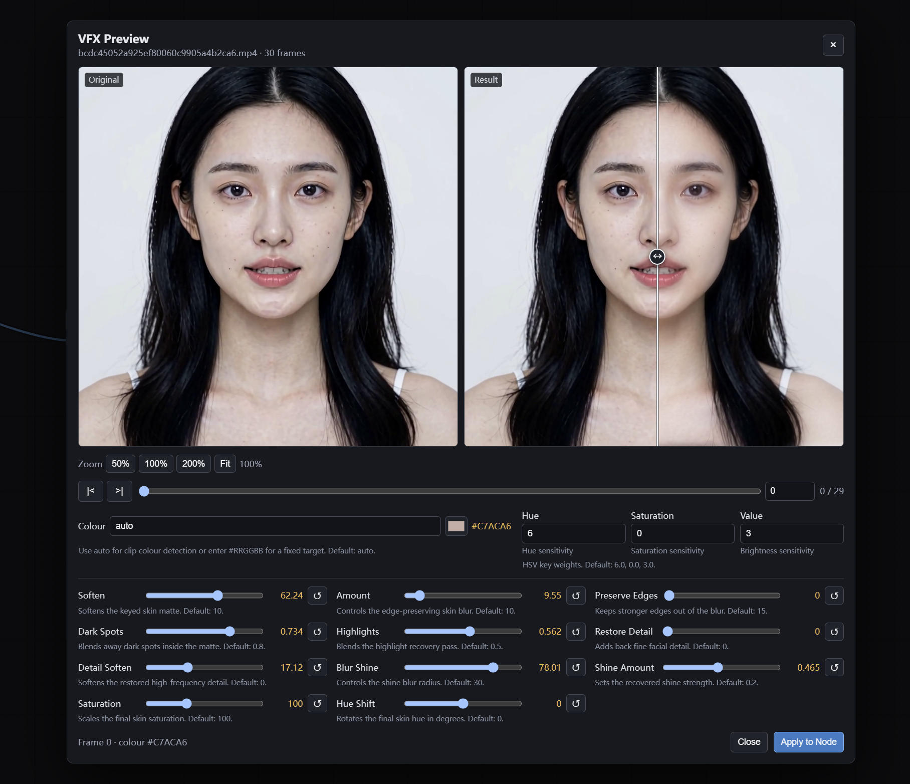

- **双视口**：左侧 `Original` 显示原始帧，右侧 `Result` 显示当前参数的处理结果。Result 中央的对比条默认在最左侧，因此打开窗口时完整显示 Result；左右拖动对比条可比较 Original 和 Result。
- **缩放和平移**：点击 `50%`、`100%`、`200%` 或 `Fit` 调整显示比例，也可以在任一视口滚动鼠标滚轮缩放。缩放超过 Fit 后，在任一视口按住鼠标左键拖动，两个视口会同步平移。
- **时间线**：拖动底部时间线快速定位帧，输入帧号可直接跳转，`|<` 和 `>|` 用于单帧步进。切换帧后只重新计算当前帧的预览结果。
- **Colour**：输入 `auto` 使用自动肤色；预览首次计算出的颜色会显示在右侧色块和 Hex 数值中。点击色块可以打开标准 RGB 取色器，选择颜色后会切换为固定 `#RRGGBB`。
- **Weights**：Hue、Saturation、Value 分成三个数值栏，分别控制 HSV 色键对色相、饱和度和明度的敏感度。
- **参数滑块**：每个滑块下方显示简短说明和默认值，右侧复位按钮可以单独恢复初始值。调整滑块后，Result 会实时重新处理当前帧。

对于运行后才生成的视频输入，先运行一次工作流建立缓存，再打开节点前端窗口。

#### 自动肤色估计

当 `colour=auto` 时，节点将加载 BiSeNet并计算皮肤区域的目标颜色。在`colour`选项输入 Hex 颜色字符串`#RRGGBB`将跳过自动检测肤色流程。

#### 输出说明

- `IMAGE`：RGB 处理结果，不包含 Alpha，可直接连接下游图像或视频节点。
- `MASK`：皮肤处理遮罩输出。


### CS SeC-4B Model Loader

加载SeC-4B 模型，为 `CS Video Segment (SeC-4B)` 节点和 Selector Preview 提供可复用的模型实例。节点扫描 `ComfyUI/models/sams/SeC-4B` 目录下的单文件权重。

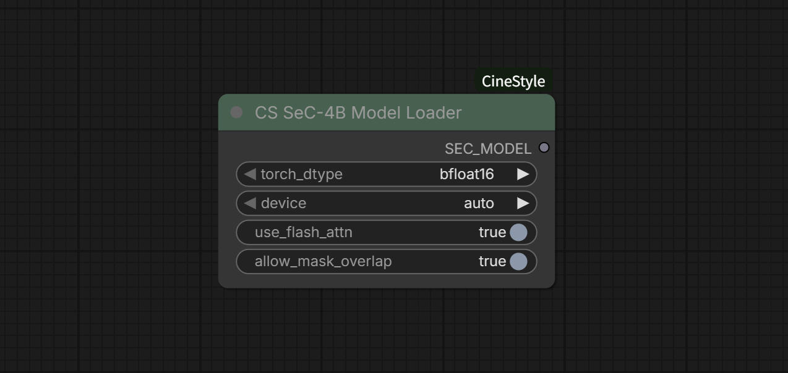

#### 节点选项说明

- `model_file`：支持 `SeC-4B-bf16.safetensors` 和 `SeC-4B-fp16.safetensors`，节点按文件原生精度加载。
- `device`：运行设备，`auto` 自动选择 CUDA，`cpu` 使用 CPU，也可选择具体的 `gpu0`、`gpu1` 等设备。
- 选择 `cpu` 时，BF16/FP16 权重会自动转换为 `float32`。
- `use_flash_attn`：高级选项，默认开启。环境没有 FlashAttention 时会回退到标准注意力。
- `allow_mask_overlap`：高级选项，默认开启，允许多个对象的 Mask 重叠。
- `SEC_MODEL`：输出的 SeC-4B 模型连接到 Video Segment 节点的 `model`。

首次执行 Loader 或首次进行 SeC Preview 时，如果选择的权重文件不存在，节点会自动从 Hugging Face 下载对应的单文件权重到 `ComfyUI/models/sams/SeC-4B`。默认 BF16 文件约 7.35 GiB。自动下载需要当前环境可以访问 Hugging Face；失败时可手动下载：

[BF16 权重下载地址](https://huggingface.co/VeryAladeen/Sec-4B/resolve/main/SeC-4B-bf16.safetensors)

[FP16 权重下载地址](https://huggingface.co/VeryAladeen/Sec-4B/resolve/main/SeC-4B-fp16.safetensors)

将所选文件放置到：

`ComfyUI/models/sams/SeC-4B`

配置和 tokenizer 已随插件放在 `py/sec_model_config`，依赖声明位于项目根目录 `requirements.txt`，推理代码和 SAM2 配置位于 `py/sec_inference` 与 `py/sec_configs`。


### CS Video Segment (SeC-4B)
使用 OpenIXCLab SeC-4B 模型，在锚点帧用多个 BBox、多个正负 Point 和粗略 Mask 定义对象，并传播到整段视频。
_workflow.jpg)

#### 使用流程

1. 先执行 [CS SeC-4B Model Loader](#cs-sec-4b-model-loader)，再把输出的 `SEC_MODEL` 连接到节点的 `model`。
2. 将 CS Load Video 的 `IMAGE` 或 `VIDEO` 输出连接到节点。`images` 与 `video_input` 同时连接时，节点优先使用 `images`。自动预览功能仅在接入CS Load Video节点时支持。
3. 点击 `Open Selector`，在锚点帧中定义一个或多个对象的提示。
4. 点击 `Preview Current Frame` 检查 SeC-4B 的当前帧分割结果，确认后点击 `Apply to Node`。
5. 执行节点，得到整段视频的 mask。默认情况下，节点执行结束会卸载 SeC-4B 的推理子模型以释放显存。

#### 节点选项说明
_node.jpg)
- `model`：`CS SeC-4B Model Loader` 输出的 `SEC_MODEL`，必需输入。
- `images`：可选 `IMAGE` 帧批次。自动预览功能仅在接入CS Load Video节点时支持。
- `video_input`：可选 `VIDEO` 输入，仅在 `images` 未连接时使用。
- `anchor_frame`：锚点帧在当前输入帧批次中的本地编号，从 `0` 开始，通常由 Selector 自动写入。
- `prompt_data`：Selector 序列化的多对象 Mask、BBox 和 Point 提示数据，不建议手动编辑。
- `tracking_direction`：传播方向，`bidirectional` 双向传播，`forward` 向后传播，`backward` 向前传播。
- `max_frames_to_track`：每个方向最多传播的帧数，`-1` 表示直到视频边界。
- `mllm_memory_size`：场景变化时用于提取对象概念的历史关键帧数量，默认 `12`。
- `offload_video_to_cpu`：将视频推理状态尽可能放到 CPU，以降低显存占用，但会降低速度。
- `auto_unload_model`：默认开启。节点执行结束后卸载 SeC-4B 子模型；下次执行或 Preview 时会自动重载。
- `Open Selector`：打开交互式提示编辑器。

#### 输出说明

- `mask`：形状为 `[帧数, 高, 宽]` 的整段视频 mask。
- `anchor_mask`：锚点帧的合并分割 mask。
- `video_info`：包含帧数、尺寸、锚点帧、传播方向和对象数量。

### CS Video Segment (SAM3.1)
使用 ComfyUI 官方 SAM3/SAM3.1 模型和推理内核，把 Selector 中定义在锚点帧的多个对象提示传播到整段视频。
SAM3.1 官方权重下载地址：[Comfy-Org/sam3.1](https://huggingface.co/Comfy-Org/sam3.1)。下载后放入 ComfyUI 的 `models/checkpoints`
_workflow.jpg)

#### 使用流程

1. 使用官方 `CheckpointLoaderSimple`加载 SAM3/SAM3.1 模型，并连接节点的 `model`。
2. 将 CS Load Video 的 `IMAGE` 或 `VIDEO` 输出连接到节点。`images` 与 `video_input` 同时连接时，节点优先使用 `images`。自动预览功能仅在接入CS Load Video节点时支持。
3. 点击节点上的 `Open Selector`，在实际输入视频的帧上定义提示。
4. 点击 Selector 的 `Preview Current Frame` 检查当前帧分割结果，确认后点击 `Apply to Node`。
5. 执行节点，得到整段视频的 mask。

#### 节点选项说明
_node.jpg)
- `model`：官方 SAM3/SAM3.1 模型，必需输入。
- `images`：可选 `IMAGE` 帧批次。自动预览功能仅在接入CS Load Video节点时支持。
- `video_input`：可选 `VIDEO` 输入，仅在 `images` 未连接时使用。自动预览功能仅在接入CS Load Video节点时支持。
- `anchor_frame`：锚点帧在当前输入帧批次中的本地编号，从 `0` 开始。通常由 Selector 自动写入。
- `prompt_data`：Selector 序列化的 Mask、BBox、Point 和对象列表，不建议手动编辑。
- `propagation_direction`：传播方向，`both` 双向传播，`forward` 向后传播，`backward` 向前传播。
- `max_objects`：SAM3.1 的最大对象槽数量，默认 `16`。
- `Open Selector`：打开交互式提示编辑器。

#### 输出说明
- `mask`：形状为 `[帧数, 高, 宽]` 的整段视频 mask。
- `anchor_mask`：锚点帧的分割 mask。
- `video_info`：包含帧数、尺寸、锚点帧、传播方向和对象数量。

## Selector 使用说明

SAM3.1 和 SeC-4B 共用同一个 Selector 框架。两者都支持多对象；SAM3.1 由官方模型批量处理对象，SeC-4B 会逐对象建立跟踪条件后合并结果。Semantic 选项卡仅对 SAM3.1 显示，SeC-4B 使用 Draw Mask、Edit BBox 和 Edit Point。

对于运行后才生成的视频输入，先运行一次工作流建立缓存，再打开节点前端窗口。

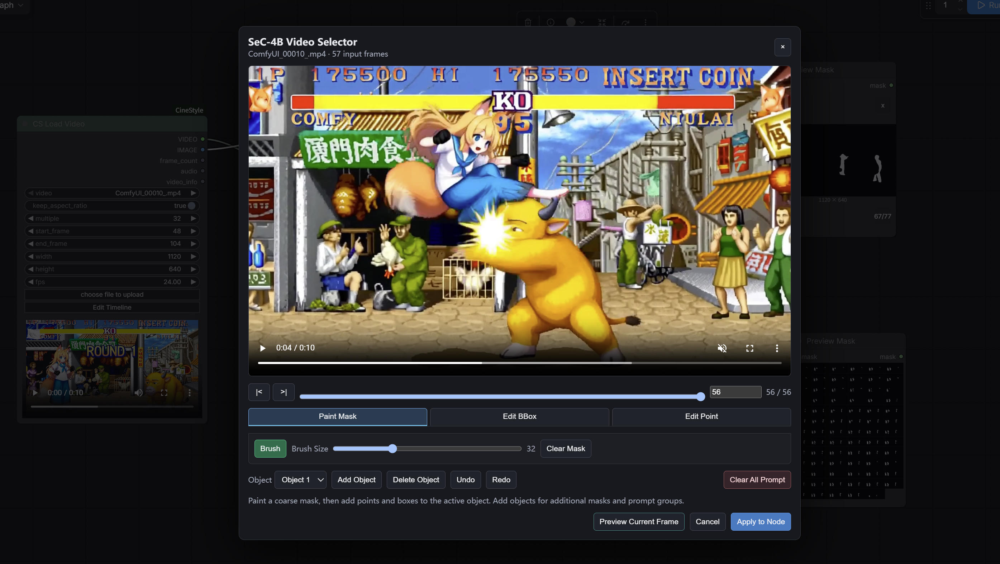

#### 时间控制和锚点帧

- 时间线上方的 `|<` 和 `>|` 用于逐帧移动，滑杆和帧号输入框用于快速定位。
- 只允许一个锚点帧存在。第一次在某帧产生有效的 Mask、BBox 或 Point 后，该帧成为锚点。
- 已存在编辑数据时切换帧，会提示“当前已存在编辑数据，切换锚点帧将自动清除，是否继续？”。确认后会清除全部对象提示和 Undo/Redo 历史。
- 切换到新帧后，只有重新添加提示，该帧才会成为新的锚点。
- 已经点击 `Apply to Node` 的工作流再次打开 Selector 时，会自动跳转到保存的锚点帧并恢复提示。
- `anchor_frame` 是当前输入帧批次的本地帧号。

#### Draw Mask

- 进入 `Draw Mask` 后，鼠标光标显示当前画笔大小的半透明空心圆。
- `Brush/Eraser` 切换键在画笔和橡皮擦之间切换；画笔状态为绿色，橡皮擦状态为红色。
- `Brush Size` 范围为 `2–100`。拖动滑杆或在视频画布上滚动鼠标滚轮快速调整；按住 `Shift` 滚轮可大步调整。
- `Clear Mask` 清除当前对象的粗略 Mask。
- 粗略 Mask 只作为模型提示，点击 Preview 后画布会隐藏粗略笔迹，仅显示模型返回的分割结果。

#### Edit BBox

- 点击 `Add BBox` 后，在视频画布上拖出一个新框；松开鼠标后自动退出添加状态。
- 鼠标移到四角时可拖拽调整宽高，移到水平或垂直边时可单独调整对应边的位置。
- 鼠标移到框内部时显示手形光标，拖拽可移动整个框。
- 在框内部点击右键，选择“删除BBox”删除当前对象的框。
- 使用公共的 `Add Object` 创建更多对象，再为每个对象添加自己的 BBox。
- `Clear All BBox` 清除所有对象的 BBox，但不会清除 Point 或粗略 Mask。

#### Edit Point

- 空白处左键添加 positive point。
- 空白处右键添加 negative point。
- 已有 Point 左键按住并拖动可移动；如果没有实际移动，释放鼠标不会新增或修改 Point。
- 已有 Point 右键打开菜单，可删除 Point，或在 positive/negative 之间切换。
- `Clear All Point` 清除所有对象的 Point，但不会清除 BBox 或粗略 Mask。

#### 对象和公共按钮

- `Object` 下拉框选择当前编辑对象。
- `Add Object` 增加对象；`Delete Object` 删除当前对象。
- `Undo` / `Redo` 撤销或恢复最近一次提示编辑。
- `Clear All Prompt` 清除所有对象的 Mask、BBox 和 Point。
- `Preview Current Frame` 只运行当前锚点帧的模型分割，结果用于检查提示是否合理，不会替代最终整段视频执行。
- `Cancel` 关闭窗口并放弃本次未应用的修改。
- `Apply to Node` 将提示数据和锚点帧写入节点。

### CS Load Video
把视频文件加载到 ComfyUI，并提供一个可交互的时间线编辑窗口。节点执行时会读取视频帧、音频和帧率，根据工作流中保存的设置截取和调整内容，然后输出给下游节点。

- 从节点直接选择和上传视频。
- 加载视频后，`width` 和 `height` 会自动初始化为源视频宽高，并分别按 `multiple` 四舍五入。
- 直接修改 `width` 或 `height` 时，另一项会根据源视频宽高比自动联动回填；修改 `multiple` 时两项会重新取整。
- 视频预览上方的蓝色指示条标记视频输出的出入点范围。
- 点击节点上的`Edit Timeline`按钮进入时间线界面：
    通过时间线拖动入点和出点，支持逐帧定位。
    通过 `Set In` 和 `Set Out` 按钮，把视频预览窗口的当前帧快速设为入点或出点。
    使用蓝色当前帧指针，在时间线上拖动即可同步预览对应视频帧。
    出入点设置按钮组的 `Play` 只播放已设置的入点到出点范围。
    视频预览窗口的白色播放键仍然播放完整视频，不受入出点限制。

#### 预览 Cache
每个 CS Load Video 节点都自动为下游预览提供 Preview Cache 并缓存在 ComfyUI 临时目录中，随ComfyUI启动自动清除上次残余缓存。
Preview Cache 只用于前端窗口播放、预览和波形显示。

#### 节点选项说明：
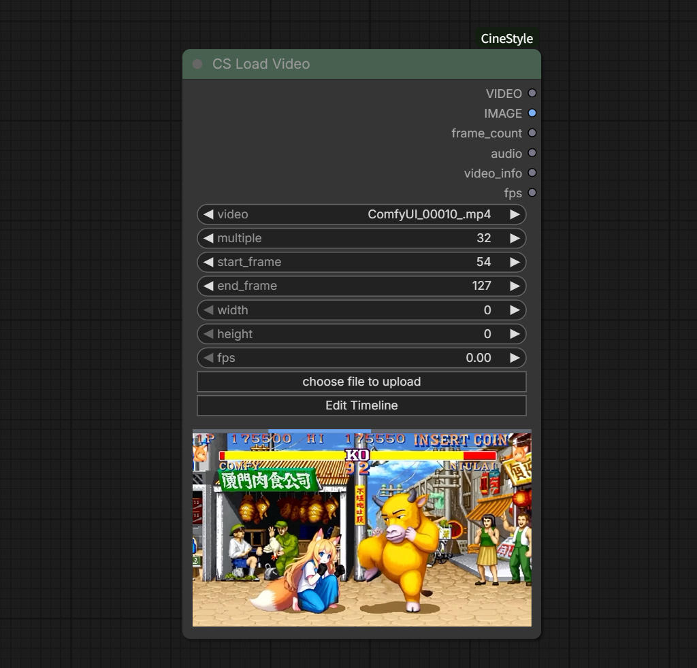
- video： 选择`choose file to upload` 按钮手动加载视频，或拖动视频文件放到节点以加载视频。
- multiple：整数，默认 `32`。 输出尺寸的取整倍数。宽度和高度会按最近的倍数四舍五入。
- start_frame： 整数，默认 `0`。 起始帧，使用从 `0` 开始的帧编号。
- end_frame：整数，默认`-1` |。 结束帧，`-1` 表示使用视频最后一帧。
- width： 整数，输出宽度。加载视频后会按源视频宽度和 `multiple` 自动初始化；手动修改时高度会按源视频宽高比联动计算，并始终按 `multiple` 取整。
- height： 整数，输出高度。加载视频后会按源视频高度和 `multiple` 自动初始化；手动修改时宽度会按源视频宽高比联动计算，并始终按 `multiple` 取整。
- fps： 浮点数，默认 `0`。 输出帧率。`0` 表示保留源视频帧率；输入其他数值时会按目标帧率重新采样帧。
- choose file to upload：点击按钮从本地加载视频。
- Edit Timeline：进入时间线界面。
其中 `start_frame`、`end_frame`、`width`、`height` 和 `fps` 可通过 `Edit Timeline` 窗口设置或在节点控件中直接编辑。

#### Edit Timeline 时间线界面

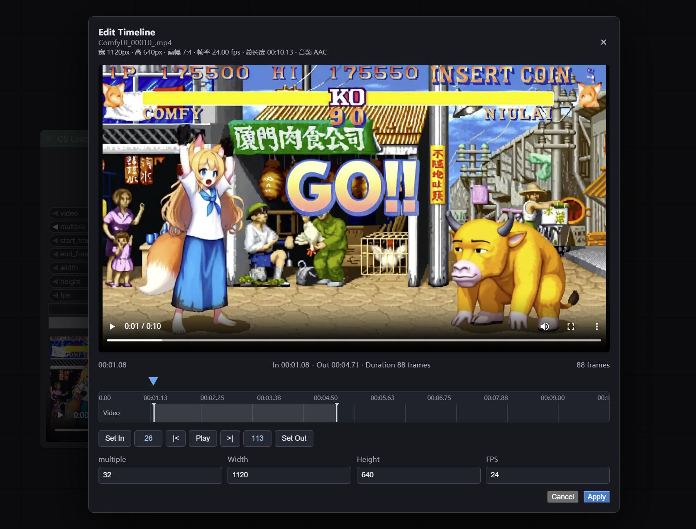

时间线界面从上到下依次包含视频预览、原视频信息、时间读数、当前帧指针、入出点标记栏、时间线操作按钮和输出参数。视频预览上方有一条 4 像素高的 In/Out 区间指示条：灰色表示完整视频范围，蓝色表示当前入点到出点范围。

##### 入点和出点标记

标记栏中的两个白色手柄分别表示入点和出点：

- 左侧手柄是入点。
- 右侧手柄是出点。
- 可以直接拖动手柄调整范围。

##### 时间线按钮
- `Set In`：将视频预览当前帧设为入点。如果当前帧晚于出点，会自动修正出点。
- `入点指示`：显示当前入点帧号，点击可跳转到入点。
- `|<`： 跳转到上一帧。只受视频首帧限制，不受入点限制。
- `Play`: 只播放从入点到出点的内容，播放到出点后自动暂停。再次播放时，如果当前帧不在范围内，会从入点重新开始。
- `>|`: 跳转到下一帧。只受视频尾帧限制，不受出点限制。
- `出点指示`：显示当前出点帧号，点击可跳转到出点。
- `Set Out`： 将视频预览当前帧设为出点。如果当前帧早于入点，会自动修正入点。
-
##### 时间线参数
- multiple：整数，默认 `32`。 输出尺寸的取整倍数。宽度和高度会按最近的倍数四舍五入。
- width： 整数，输出宽度。修改时高度会按源视频宽高比联动计算，并始终按 `multiple` 取整。
- height： 整数，输出高度。修改时宽度会按源视频宽高比联动计算，并始终按 `multiple` 取整。
- fps： 浮点数，默认是源视频编码的帧率。手动改变将保持至节点作为输出帧率；保持不变则返回节点时仍为`0`，表示原始帧率。

#### 输出说明
- video：标准 ComfyUI `VIDEO` 类型，包含时间线选段、尺寸、帧率和音频，可直接连接官方视频节点。
- IMAGE: 输出的video图像帧批次。
- frame_count: 实际输出帧数。修改 FPS 后，该数值可能与源视频选段帧数不同。
- audio: 选定时间范围内的音频。没有音频轨道时输出为空。
- video_info: 包含源视频和输出视频的 FPS、帧数、时长、宽高、入点和出点等信息，以及 loader 标识。
- fps：浮点数，实际输出视频的帧率。未设置目标 FPS 时为源视频帧率，设置目标 FPS 后为重新采样后的输出帧率。


### CS Save Video
基于 ComfyUI 官方 `Save Video` 节点，增加 save metadata 和符合行业惯例的 H.264 目标码率控制选项。
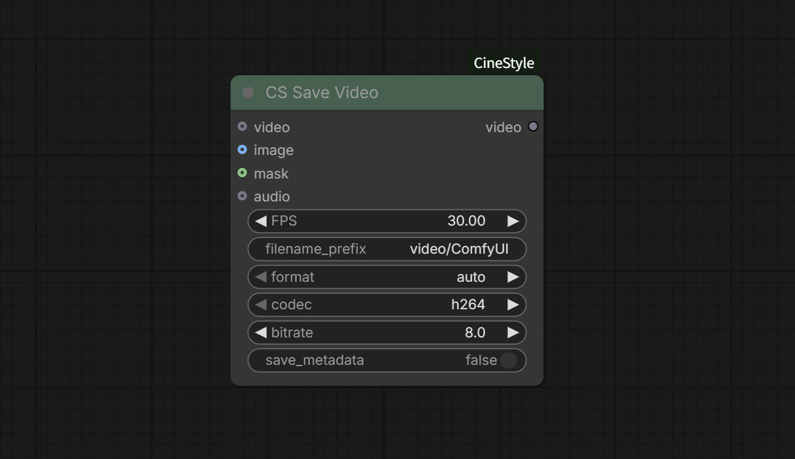

- `video`：标准 ComfyUI `VIDEO` 输入。
- `filename_prefix`：输出文件名前缀，支持官方的日期和节点控件格式化语法。
- `format`：输出容器格式，默认 `auto`。
- `codec`：视频编码方式，默认 `h264`。选择 H.264 时显示码率控件。
- `H.264 bitrate (Mbps)`：H.264 目标码率，浮点数保留 1 位小数，范围 `1.0–160.0 Mbps`，默认 `8.0 Mbps`。范围覆盖官方建议的低分辨率到 8K 高帧率视频；常见 1080p 视频可从 `8.0 Mbps` 开始，高帧率 1080p 可提高到约 `12.0 Mbps`。
- `save_metadata`：默认关闭。开启后保存的文件将写入工作流和源视频 metadata。


##  声明
ComfyUI_CineStyle节点遵照MIT开源协议，有部分功能代码和模型来自其他开源项目。如果作为商业用途，请查阅原项目授权协议使用。
