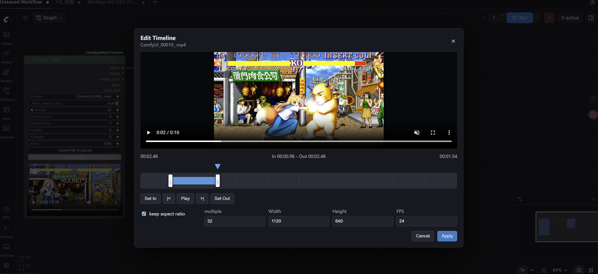

# ComfyUI CineStyle

ComfyUI_CineStyle 是一组为ComfyUI 视频工作流开发的，更易于使用的自定义节点。
本项目不能替代专业视频编辑软件。


### 安装插件
* 在CompyUI插件目录(例如“CompyUI\custom_nodes\”)中打开cmd窗口，键入    
```
git clone https://github.com/chflame163/ComfyUI_CineStyle.git
```


### 如何找到本节点组
* 在ComfyUI画布点击右键 - Add Node, 找到 "😺dzNodes/CineStyle"。    


* 或者在ComfyUI画布双击, 在搜索框输入"cinestyle"。


## 更新说明

* 添加 [CS Load Video](#cs-load-video) 节点，用于加载视频，支持出入点设置、更改尺寸、帧率等。
* 添加 [CS Video Segment (SAM3.1)](#cs-video-segment-sam31) 节点，在任意视频帧用语义、点或框定义对象，并自动传播 mask。
* 添加 [CS Video Segment (SeC-4B)](#cs-video-segment-sec-4b) 节点，使用 SeC-4B 的概念理解和 LongSAM2.1 记忆传播 mask。
* 添加 [CS Save Video](#cs-save-video) 节点，支持可选 metadata 写入和 H.264 目标码率控制。

## 节点说明

### CS Load Video
把视频文件加载到 ComfyUI，并提供一个可交互的时间线编辑窗口。节点执行时会读取视频帧、音频和帧率，根据工作流中保存的设置截取和调整内容，然后输出给下游节点。

- 从节点直接选择和上传视频。
- 点击节点上的`Edit Timeline`按钮进入时间线界面。
- 通过时间线拖动入点和出点，支持逐帧定位。
- 通过 `Set In` 和 `Set Out` 按钮，把视频预览窗口的当前帧快速设为入点或出点。
- 使用蓝色当前帧指针，在时间线上拖动即可同步预览对应视频帧。
- 出入点设置按钮组的 `Play` 只播放已设置的入点到出点范围。
- 视频预览窗口的白色播放键仍然播放完整视频，不受入出点限制。
- 开启保持宽高比后，修改宽度或高度会自动联动另一项。
- 输出尺寸可以自动四舍五入到指定倍数，适合视频模型常见的尺寸要求。
- 入点、出点、宽度、高度和 FPS 会保存到 ComfyUI 工作流中，重新打开工作流后仍可复现相同设置。
- 输出同时包含图像帧批次、音频和结构化视频信息。

#### 节点选项说明：

- video： 选择 ComfyUI 输入目录中的视频，或使用上传控件上传视频文件。
- keep_aspect_ratio：布尔值，默认`true`。开启后，宽度和高度按照源视频的原始宽高比联动计算。 
- multiple：整数，默认 `32`。 输出尺寸的取整倍数。宽度和高度会按最近的倍数四舍五入。 
- start_frame： 整数，默认 `0`。 起始帧，使用从 `0` 开始的帧编号。
- end_frame：整数，默认`-1` |。 结束帧，`-1` 表示使用视频最后一帧。 
- width： 整数，默认`0`。 输出宽度。`0` 表示根据源视频尺寸和 `multiple` 自动计算。 
- height： 整数，默认`0`。 输出高度。`0` 表示根据源视频尺寸和 `multiple` 自动计算。 
- fps： 浮点数，默认 `0`。 输出帧率。`0` 表示保留源视频帧率；输入其他数值时会按目标帧率重新采样帧。 
- choose file to upload：点击按钮从本地加载视频。
- Edit Timeline：进入时间线界面。
其中 `start_frame`、`end_frame`、`width`、`height` 和 `fps` 可通过 `Edit Timeline` 窗口设置或在节点控件中直接编辑。

#### Edit Timeline 时间线界面



时间线界面从上到下依次包含视频预览、时间读数、当前帧指针、入出点标记栏、时间线操作按钮和输出参数。


##### 入点和出点标记

标记栏中的两个白色手柄分别表示入点和出点：

- 左侧手柄是入点。
- 右侧手柄是出点。
- 可以直接拖动手柄调整范围。
- 点击标记栏空白区域时，程序会根据点击位置距离哪个手柄更近来调整对应边界。

##### 时间线按钮
- `Set In`：将视频预览当前帧设为入点。如果当前帧晚于出点，会自动修正出点。
- `|<`： 跳转到上一帧。只受视频首帧限制，不受入点限制。 
- `Play`: 只播放从入点到出点的内容，播放到出点后自动暂停。再次播放时，如果当前帧不在范围内，会从入点重新开始。 
- `>|`: 跳转到下一帧。只受视频尾帧限制，不受出点限制。 
- `Set Out`： 将视频预览当前帧设为出点。如果当前帧早于入点，会自动修正入点。 

#### 输出说明
- video：标准 ComfyUI `VIDEO` 类型，包含时间线选段、尺寸、帧率和音频，可直接连接官方视频节点。
- IMAGE: 输出的video图像帧批次。
- frame_count: 实际输出帧数。修改 FPS 后，该数值可能与源视频选段帧数不同。 
- audio: 选定时间范围内的音频。没有音频轨道时输出为空。 
- video_info: 包含源视频和输出视频的 FPS、帧数、时长、宽高、入点和出点等信息。

### CS Video Segment (SAM3.1)
使用 ComfyUI 官方 SAM3 Detect 推理内核，把视频中定义在任意锚点帧的对象 mask 传播到整段视频。节点不包含 SAMMatte 的 mask refine 部分。

- 将视频输入连接到节点后，点击节点上的 `Open Selector`，即可打开与实际输入帧范围一致的预览和标注窗口。Selector 会递归沿 `VIDEO`/`IMAGE` 上游连接查找官方或第三方视频 Load 节点，不限定为 `CS Load Video`。
- 如果上游来源是运行后才生成的 `VIDEO`/`IMAGE` 张量，先运行一次工作流；节点会把实际收到的输入帧缓存到临时目录，之后 Selector 使用这份缓存预览和执行交互式 Preview。
- `Points` 模式：左键点击空白处添加正点；悬停已有点时显示移动光标，按住左键可拖动该点，未移动直接释放不会产生操作；右键点击空白处添加负点，右键点击已有点可删除该点或切换正负属性。
- `Bounding box` 模式：在预览画布中拖出对象框；拖动四角可同时调整宽高，拖动四条边可单独调整对应边的位置。
- `Semantic` 模式：直接输入文字提示；节点会使用 `CheckpointLoaderSimple` 加载的 SAM3 checkpoint 内置文本编码器，不需要额外连接 `CLIP` 或 `CONDITIONING`。
- 点击 `Preview current frame`，只对当前帧执行一次 SAM3 Detect，并在窗口中叠加显示分割结果。Preview 会识别连接到 `MODEL` 的 `CheckpointLoaderSimple` 或 `Load Diffusion Model`。
- 标注窗口中的帧号就是实际输入 batch 的 `anchor_frame`，前后传播方向可在高级选项中设置；`CS Load Video` 的裁剪范围会自动换算为源视频帧。
- 节点不再单独持有视频文件选择框，执行和 Selector 使用同一个上游视频输入；对于运行时生成的输入，Selector 使用最近一次执行缓存。

输出 `mask` 为 `[帧数, 高, 宽]` 的视频 mask，`anchor_mask` 为锚点帧 mask，`video_info` 包含帧数、尺寸、锚点帧和对象数量。

### CS Video Segment (SeC-4B)
使用 OpenIXCLab SeC-4B 模型和内置 LongSAM2.1 视频记忆编码器，在任意锚点帧用点或框定义对象并传播 mask。节点不需要 `CLIP` 或 `CONDITIONING`；SeC 会在场景变化时自动重新提取对象概念。

- 推荐连接 `CS SeC-4B Model Loader`，它会从 `models/sams/SeC-4B` 加载已经下载的权重，并登记一个可复用的 Preview 模型 token；如果没有执行 Loader，首次 Preview 会按默认配置自动冷加载并登记模型。
- 将视频输入连接到节点后点击 `Open Selector`；SeC Selector 只提供 `Points` 和 `Bounding box` 两种方式。Selector 会递归查找官方或第三方视频 Load 节点；运行时生成的输入需要先运行一次工作流以建立缓存。
- `input_mask` 是可选外部 MASK 输入，可和点提示一起用于锚点初始化。
- `tracking_direction` 支持 `forward`、`backward` 和 `bidirectional`；`mllm_memory_size` 控制场景变化时使用的历史关键帧数量。
- Preview 只运行锚点帧的 LongSAM2.1 初始化，不执行整段视频传播；优先使用 Loader 登记的模型 token，没有 token 时才自动冷加载默认 SeC-4B，后续请求复用注册模型。
- 默认 `auto_unload_model` 会在节点执行后释放 SeC-4B 的视觉、语言和 LongSAM2.1 子模型，但保留加载元数据；下一次执行或 Preview 会按 token 自动重载。

SeC-4B 的 Python 推理模块和 LongSAM2.1 配置位于 `py/sec_inference` 与 `py/sec_configs`，依赖声明位于项目根目录 `requirements.txt`。该模型快照约 14.15 GiB，请确保 `models/sams/SeC-4B` 已存在。

### CS Save Video
基于 ComfyUI 官方 `Save Video` 节点，增加save metadata和H264 bitrate选项。

- `video`：标准 ComfyUI `VIDEO` 输入。
- `filename_prefix`：输出文件名前缀，支持官方的日期和节点控件格式化语法。
- `format`：输出容器格式，默认 `auto`。
- `codec`：视频编码方式，默认 `h264`。选择 H.264 时显示码率控件。
- `H.264 bitrate (Mbps)`：H.264 目标码率，浮点数保留 1 位小数，范围 `1.0–160.0 Mbps`，默认 `8.0 Mbps`。范围覆盖官方建议的低分辨率到 8K 高帧率视频；常见 1080p 视频可从 `8.0 Mbps` 开始，高帧率 1080p 可提高到约 `12.0 Mbps`。
- `save_metadata`：默认关闭。开启后保存的文件将写入工作流和源视频 metadata。

##  声明
ComfyUI_CineStyle节点遵照MIT开源协议，有部分功能代码和模型来自其他开源项目。如果作为商业用途，请查阅原项目授权协议使用。
